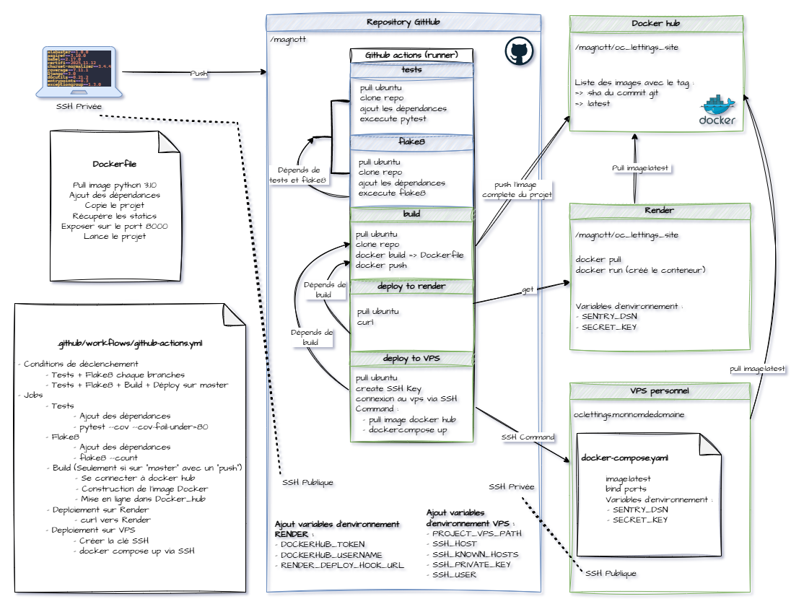

CI/CD Architecture & Deployment
=================================

This section describes the continuous integration and deployment architecture used to automate testing, building, and deploying the OC Lettings application.

Overview
--------

The project implements a **fully automated CI/CD pipeline** using GitHub Actions that:

1. **Validates** code quality and functionality on every push
2. **Containerizes** the application using Docker
3. **Deploys** automatically to production on the master branch

**Key principle**: Every push to master that passes tests is automatically deployed to production.

Pipeline Architecture
---------------------

The CI/CD workflow is defined in ``.github/workflows/github-actions.yml`` and consists of four main jobs:

Workflow Diagram
~~~~~~~~~~~~~~~~

**Pipeline stages**:

1. **Test** → Runs unit tests with coverage validation (≥80%)
2. **Lint** → Validates code quality with flake8
3. **Build** → Creates Docker image and pushes to DockerHub
4. **Deploy** → Triggers deployment on Render (master branch only)

Job Descriptions
----------------

Test Job
~~~~~~~~

**Purpose**: Validate application functionality and code coverage

**Triggers**: Every push to any branch

**Steps**:

- Checkout code
- Set up Python 3.10 environment
- Install dependencies from ``requirements.txt``
- Run pytest with coverage measurement
- Fail if coverage < 80%

**Technologies**: pytest, pytest-django, pytest-cov

Lint Job
~~~~~~~~

**Purpose**: Ensure code quality and PEP8 compliance

**Triggers**: Every push to any branch

**Steps**:

- Checkout code
- Set up Python 3.10 environment
- Install dependencies
- Run flake8 with project configuration (``setup.cfg``)

**Technologies**: flake8

Build Job
~~~~~~~~~

**Purpose**: Containerize the application and publish Docker image

**Triggers**: Only after test and lint jobs succeed, only on master branch

**Steps**:

- Checkout code
- Login to DockerHub using secrets
- Build Docker image from ``Dockerfile``
- Tag image with:
  
  - ``latest`` (for production)
  - ``{commit-sha}`` (for versioning and rollback)

- Push both tags to DockerHub registry

**Technologies**: Docker, DockerHub

**Image naming**: ``{username}/oc-lettings-site:latest`` and ``{username}/oc-lettings-site:{sha}``

Deploy Job
~~~~~~~~~~

**Purpose**: Trigger production deployment

**Triggers**: Only after successful build, only on master branch

**Steps**:

- Send HTTP request to Render deploy hook
- Render pulls latest Docker image from DockerHub
- Render restarts the application with new image

**Technologies**: Render Web Service, Deploy Hooks

Deployment Targets
------------------

Primary: Render
~~~~~~~~~~~~~~~

**Platform**: Render.com

**Type**: Docker-based Web Service with automatic deployment via webhook

For detailed configuration (environment variables, secrets, setup steps), see the 
`Render configuration section in README <https://github.com/MagNott/P13_Mettez_echelle_application_django_architecture_modulaire#2-configuration-render>`_.

**Deployment process**:

1. Render receives webhook call from GitHub Actions
2. Render pulls latest image from DockerHub
3. Render stops old container and starts new one
4. Application is live at ``https://oc-lettings-site-wkk3.onrender.com/``

**Advantages**:

- Automatic HTTPS certificates
- Free tier available for testing

Alternative: VPS with Docker Compose
~~~~~~~~~~~~~~~~~~~~~~~~~~~~~~~~~~~~~

**Platform**: Custom VPS (Apache + Docker)

**Purpose**: Demonstrates additional deployment capability (educational)

**Configuration**:

- Apache reverse proxy with SSL certificates
- Docker Compose for container orchestration
- SSH-based deployment from GitHub Actions
- Available at custom domain

**Note**: This is a secondary deployment option and not the primary production target.

For detailed deployment procedures and step-by-step instructions, see the 
`project README <https://github.com/MagNott/P13_Mettez_echelle_application_django_architecture_modulaire#déploiement>`_.

Branching Strategy
------------------

Deployment Behavior by Branch
~~~~~~~~~~~~~~~~~~~~~~~~~~~~~~

- **master branch**: Full pipeline execution (test → lint → build → deploy)
- **Other branches**: Partial execution (test → lint only)

This ensures that:

- All branches are tested and validated
- Only master branch changes reach production
- Pull requests can be validated before merging

Docker Containerization
-----------------------

Container Architecture
~~~~~~~~~~~~~~~~~~~~~~

The application is containerized using a multi-stage Dockerfile:

**Base image**: ``python:3.10``

**Container configuration**:

- Working directory: ``/app``
- Dependencies installed from ``requirements.txt``
- Static files collected with ``collectstatic``
- Application served by **gunicorn** on port 8000
- WhiteNoise handles static file serving

**Exposed port**: 8000

**Entry point**: ``gunicorn oc_lettings_site.wsgi:application``

Monitoring & Observability
---------------------------

Sentry Integration
~~~~~~~~~~~~~~~~~~

**Purpose**: Track errors and performance in production

**Configuration**:

- SDK: ``sentry-sdk==2.44.0``
- Integration: Django + logging
- Features enabled:
  
  - ``send_default_pii=True``: Captures user context (IP, headers)
  - ``enable_logs=True``: Captures application logs

**Captured data**:

- Unhandled exceptions
- Application logs (WARNING, ERROR, CRITICAL)
- Request context (URL, method, headers)
- User information (IP address, browser)
