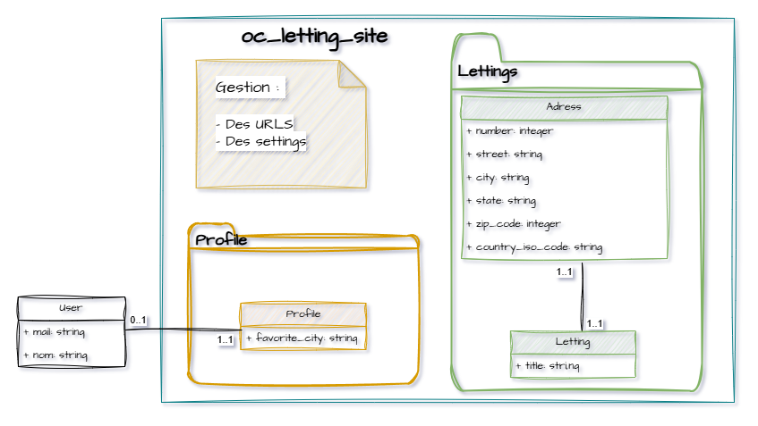

Database Models
===============

This section describes the database structure and data models used in the OC Lettings application.

Database Overview
-----------------

The application uses **SQLite** as its database engine for both development and production environments.

The data model is organized into three main models across two Django apps:

- **lettings** app: ``Address`` and ``Letting`` models
- **profiles** app: ``Profile`` model
- Built-in Django ``User`` model (``django.contrib.auth``)

Entity-Relationship Diagram
----------------------------

The following diagram illustrates the relationships between models:

.. note::
   The Django table is intentionally represented in a simplistic way with few attributes.

Model Descriptions
------------------

Address Model
~~~~~~~~~~~~~

**App**: ``lettings``

**Purpose**: Stores structured physical address information for rental properties.

**Fields**: See detailed field documentation in :doc:`api_reference`.

Letting Model
~~~~~~~~~~~~~

**App**: ``lettings``

**Purpose**: Represents a property available for rent, linked to a unique address.

**Fields**: See detailed field documentation in :doc:`api_reference`.

Profile Model
~~~~~~~~~~~~~

**App**: ``profiles``

**Purpose**: Extends Django's built-in User model with additional user information.

**Fields**: See detailed field documentation in :doc:`api_reference`.

More details
------------

For detailed API documentation of these models, see the :doc:`api_reference` section.
